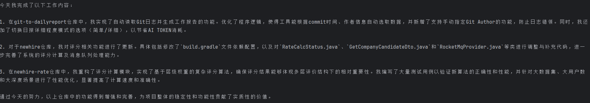
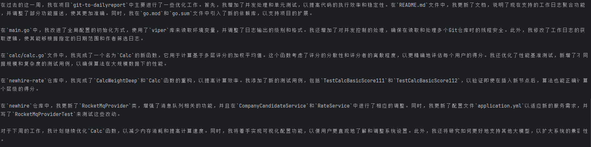

# Git to DailyReport

将Git日志通过大模型自动转换成每日工作报告

[](https://github.com/muyu66/git-to-dailyreport/releases)
[](https://opensource.org/licenses/MIT)

## 特点

* **所码即所报**：无人工干预地自动读取Git日志，根据commit时间、作者自动选取，上传大模型解析成工作报告
* **报告聚合**：支持多个仓库的工作量自动聚合，自动加权均衡上报
* **多模型适配**：暂时只支持通义千问大模型、通义千问开源大模型
* **多仓库**：自动读取指定多个目录下的所有仓库
* **中英双语**：可用于外企工作汇报
* **云端/本地双启动**：支持阿里灵积服务、ollama本地模型
* 自动/手动指定Git Author，防止工作日志错领
* 支持切换日报详细程度模式 (简单/详细)，简单模式可以节省AI TOKEN消费
* 支持周报
* 支持终端显示工作报告，亦或是生成文本文件
* 支持AI Flow工作方式，提供模型文本准确度


## 一键开始

Windows

    双击 一键生成日报.bat
    OR
    双击 一键生成周报.bat

* 开通阿里大模型 https://dashscope.aliyun.com
* 配置文件 需要将`config.sample.yaml`重命名为`config.yaml`，并填写配置
* 确保`config.yaml`与`report.exe`在同一个目录下

## 命令行使用

    $ .\bin\report.exe

示例

    $ .\bin\report.exe -c week

| 参数 | 默认值 | 可选值      | 描述     |
|----|-----|----------|--------|
| -c | day | day week | 工作报告周期 |

## 效果展示

日报：

周报：

周报：

```text
尊敬的领导：

您好！我是程序员周宇，本周我主要完成了以下工作内容。

1. 更新评分相关功能：
   在newhire仓库中，我对评分相关功能进行了更新，以确保其正常运行和提供准确的评分数据。这个改动对于提升我们的工作效率和准确性至关重要。

2. 添加并发和单测支持：
   在git-to-dailyreport仓库中，我添加了并发和单测的支持，这将有助于我们更好地测试代码并提高开发效率。同时，我还对代码进行了一些优化和调整，以确保项目的稳定性和可靠性。

3. 完成项目整合：
   在newhire-rate仓库中，我完成了项目整合工作，并进行了性能优化。通过这些改进，我们的系统将能够更高效地处理大量数据，并为用户提供更好的体验。

在接下来的一周里，我计划继续关注以下几个方面的工作：

1. 优化代码结构和性能：为了提高系统的稳定性，我打算进一步优化代码结构和性能，以减少潜在的错误和提高整体运行效率。

2. 引入新的大模型支持：我将继续研究如何引入更多种类的大模型支持，以便我们可以根据不同的场景和需求选择最合适的模型。

3. 增强可视化配置：为了让用户更容易理解和使用我们的系统，我将努力增强可视化配置功能，使用户可以更加直观地设置和管理自己的参数。

感谢您抽出宝贵的时间阅读我的工作报告。如果您有任何问题或建议，请随时与我联系。我会尽我最大的努力来完成下周的工作，并不断提升我们的产品和服务质量。
```

周报：

```text
Subject: Weekly Report - Mar 18 to Mar 24, 2024
Dear [Boss's Name],

I hope this email finds you well. I am writing to provide an overview of my work activities for the week ending March 24th, 2024.

1. Update on Rating-Related Features (March 18)
This week, I focused on updating the rating-related features in the newhire repository. I made changes to the build.gradle file to enhance the overall functionality and user experience.
2. Addition of More Features (March 22)
In the git-to-dailyreport repository, I added more features to improve the tool's capabilities. These updates include support for weekly reports and a terminal display option for generating reports. The README.md file was also updated with detailed information about these new features.
3. Completion of Newhire-Rate Project (March 19)
The newhire-rate project reached completion this week. I refactored and optimized several components, including the calc package, benchmarking tests, and consumer.go. These improvements led to significant performance enhancements, as demonstrated by the benchmark results.
4. Initialization of News-by-AI Project (March 22)
I began working on the news-by-ai project by setting up the initial files and dependencies. This includes creating the .gitignore, ai.go, config.go, go.mod, and go.sum files, as well as the main.go entry point for the application.

Looking ahead to next week, I plan to continue enhancing the git-to-dailyreport tool by addressing any bugs or issues that may arise. Additionally, I will focus on further developing the news-by-ai project, incorporating artificial intelligence algorithms to generate news content.

Thank you for your time and consideration. If you have any questions or require further clarification on any of the tasks mentioned above, please do not hesitate to reach out.

Best regards,

[Your Name]
[Your Title]
```

## 编译 Win64

    .\build.bat # 编译脚本
    .\bin\report.exe # 开始使用

## 配置文件示例

config.yaml (与report.exe同目录)

```yaml
ai:
  # [aliyun|ollama]
  name: aliyun
  ak: sk-xxxxxxxxxxxxxxxxxxx
  # qwen1.5-72b-chat ⭐⭐⭐⭐
  # qwen1.5-14b-chat ⭐⭐⭐
  # qwen1.5-7b-chat ⭐⭐
  # qwen-1.8b-chat ⭐
  # qwen-plus 未知
  # qwen-turbo 未知
  # qwen-max-1201 未知
  # qwen-max-longcontext ⭐⭐⭐⭐
  model: qwen-max-longcontext
git:
  # 不会空则以此username为准，防止误领别人的工作
  # 为空字符串则自动获取
  username:
  repo:
    # [数组]
    # 自动遍历目录下的所有git仓库
    # 可以填项目集中的目录: C:\Web
    # 也可以填具体仓库目录: C:\Web\niubiGame
    - C:\Web
report:
  # 报告模式
  # [normal 详细叙述] [simple 简单概要]
  mode: normal
  # 间隔多少天汇报一次，默认一天报告一次
  # 1=只含今天，2=今天和昨天
  intervalDay: 1
  # 输出模式
  # file 输出文本文件
  # print 打印到终端
  out: file
  # 报告语言 [chs|en]
  lang: chs
```

## Roadmap

* 将工作区、Stage区纳入上报的工作范围
* 可视化配置
* 更多私有大模型支持
* 更加傻瓜智能化，力求一键全自动处理
* 多种结果输出方式 (Webhook/JS内挂/EMAIL/Markdown)
* 兼容Linux/MACOS
* 将会提交的工作范围简要报告给使用者
* 应对加班等可能跨天的日报
* tty模式配置向导
* 支持本地大模型
* 接入Openai

## Contributors

[Thank you](https://github.com/muyu66/git-to-dailyreport/graphs/contributors) for contributing to the Joke-Boss!

## License

© Zhouyu, 2024

Released under the [MIT License](https://github.com/muyu66/git-to-dailyreport/blob/master/LICENSE)